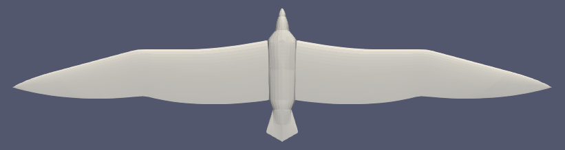
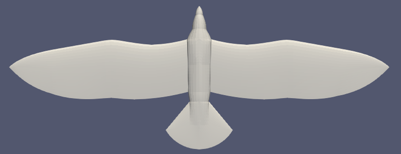
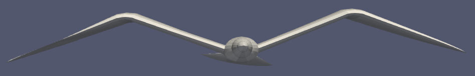
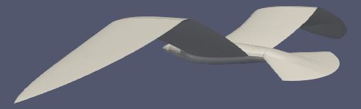
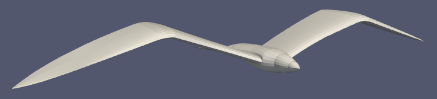
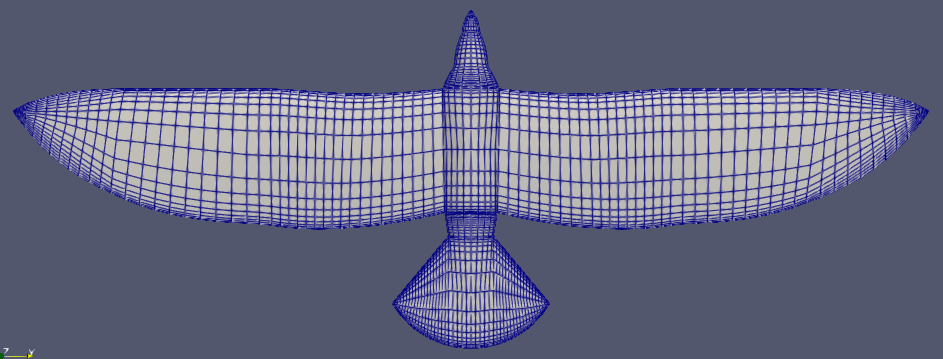

# pybird

A package that creates generic bird geometries and meshes to be used by panel codes.

## How to install:

To install the package from pip, use the code below:

### Linux
```python
pip3 install git+https://https://github.com/lucasralves/pybird
```

### Windows (not tested)
```python
pip3 install -e git+https://https://github.com/lucasralves/pybird#egg=pybird
```

## How to use:

```python
import pybird

"""
Initialize some internal global parameters
"""
pybird.init()

"""
Upload geometry parameters
"""
pybird.load('file.case')

"""
Modify some parameters
"""
pybird.model.name = 'new name'
pybird.model.description = 'new desccription'

pybird.model.geo.wing.h1 = 0.5
pybird.model.geo.wing.h2 = 0.7

"""
Save a new file containing the changes
"""
pybird.save('new_file.case')

"""
Build the mesh by defining the refinement
"""
ref = pybird.refinement.model(
    wing=pybird.refinement.wing(),
    body=pybird.refinement.body(),
    head=pybird.refinement.head(),
    tail=pybird.refinement.tail(),
)

pybird.build(ref, view=False)

"""
Create a vtp file to be open in opened paraview
"""
pybird.gen_vtk('file')
```

## Geometry:

### Active soaring wings:



### Passive soaring wings:



### Wing and tail angles:







## Mesh

The mesh is composed mainly of quadrangular elements and triangular ones in the wing and tail tip. 


